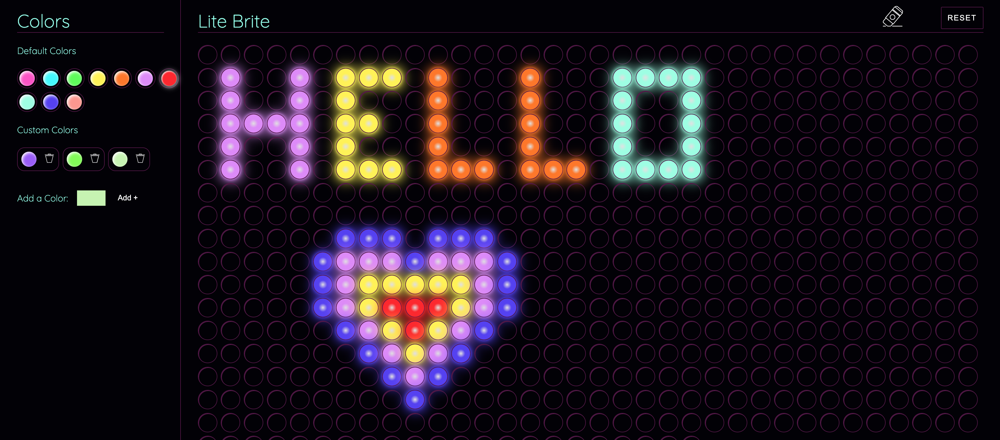
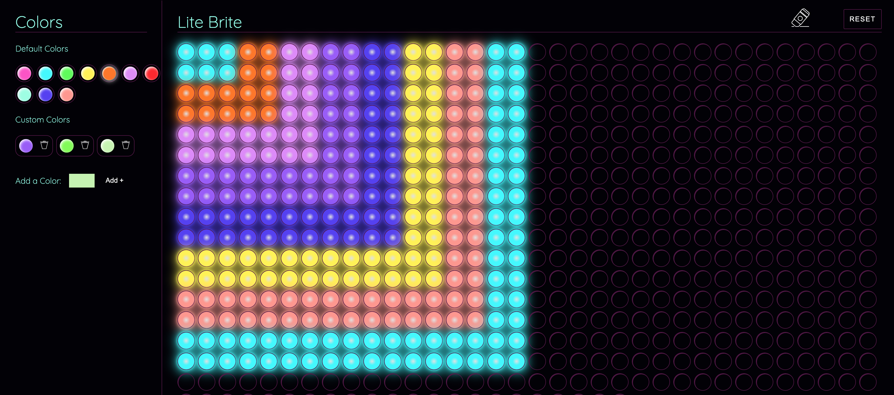

# Lite-Brite App

This front-end only app is a digital Lite Brite.
I built this to:
- practice modern redux patterns
- practice/learn typescript
- configure my own build from scratch (instead of using create-react-app)
- ...and to just have fun!

You can:
- choose from default colors
- add your own custom colors (I use json-server to persist this data) and delete them
- draw on the board by either clicking on a circle or dragging your mouse across the cricles you wish to color
- erase a color by either clicking on a circle or dragging your mouse across the cirlcs you wish to erase
- you can erase the entire board by clicking the reset button
